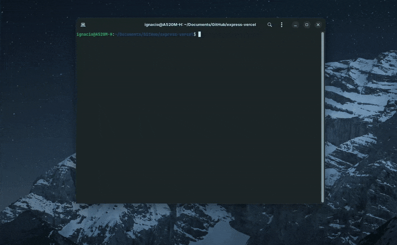

# Generate PR CLI



> Generate professional Pull Request descriptions automatically using Git diffs and AI. Built with TypeScript and powered by Google Gemini.

## Features

- **Automatic Git diff detection** - Analyzes changes between branches
- **Bilingual Support** - English & Spanish (Español) interface
- **Smart Templates** - Frontend, Backend, Custom + User templates
- **AI-powered** - Google Gemini generates professional PR descriptions
- **Interactive refinement** - Iteratively adjust with AI
- **Copy & save** - Clipboard integration + file export
- **Ticket integration** - Optional Jira/VSTS ticket support
- **Persistent config** - Save API key and preferences locally

## Quick Start

### Option 1: Use instantly with npx (Recommended)

```bash
# Get your API key first: https://aistudio.google.com/app/apikey
npx generate-pr-cli main --template frontend --ticket "[FE-123] New feature"

# The CLI will prompt you for API key on first run
npx generate-pr-cli develop --template backend --ticket "[BE-456] Fix endpoint"
```

### Option 2: Install globally

```bash
# Install once, use everywhere
npm install -g generate-pr-cli

# Then just run:
generate-pr main --template frontend --ticket "[FE-123] New feature"
```

## Command Reference

| **Action** | **Command** | **Example** |
|------------|-------------|-------------|
| **Template** | `--template <type>`<br>`-t <type>` | `--template frontend` |
| **Ticket** | `--ticket "<number>"` | `--ticket "[FE-123] Feature"` |
| **Language** | `--language <lang>`<br>`-l <lang>` | `--language en` |
| **Output** | `--output <type>`<br>`-o <type>` | `--output clipboard` |
| **Filename** | `--filename <name>`<br>`-f <name>` | `--filename pr.txt` |
| **API Key** | `--set-api-key` | Save Gemini API key |
| **Help** | `--help`<br>`-h` | Show help |

#### Quick Reference:
- **Templates**: `frontend`, `backend`, `custom`
- **Languages**: `en`, `es`  
- **Output**: `clipboard`, `file`, `console`

## First-Time Setup

1. **Get API key**: [Google AI Studio](https://aistudio.google.com/app/apikey)

2. **Run any command** - CLI guides you:
```bash
npx generate-pr-cli main --template frontend
# Will prompt: "Enter your Gemini API key:"
# Enter your API key → Done! Saved for future use
```

### Quick Commands

```bash
# One-liner commands with npx
npx generate-pr-cli main --template frontend                    # Frontend PR
npx generate-pr-cli develop --template backend --ticket BE-123  # Backend PR with ticket
npx generate-pr-cli main --language en --output clipboard       # English + clipboard

# Shortened flags for speed
npx generate-pr-cli main -t frontend              # Template selection
npx generate-pr-cli develop --ticket FE-456     # Ticket specification
npx generate-pr-cli main -l en -o clipboard     # Language + output

# Or if installed globally:
generate-pr main --template frontend              # Same commands, installed version
```

## How It Works

1. **Detect Branch** → Automatically finds your current Git branch
2. **Generate Diff** → Creates diff between your branch and target branch  
3. **Select Template** → Choose Frontend, Backend, or Custom template
4. **AI Generation** → Gemini analyzes diff and generates professional PR description
5. **Interactive Menu** → Refine, copy, save, or finish

---

## Requirements

- **Node.js** 20+ 
- **Git** repository
- **Google Gemini** API key ([free](https://aistudio.google.com/app/apikey))

---

## Ready to Get Started?

```bash
npx generate-pr-cli main --template frontend --ticket "[FE-123] Your feature"
```

---
**[Report Issues →](https://github.com/ignaciojsoler/generate-pr-cli/issues)** | **[View on npm →](https://www.npmjs.com/package/generate-pr-cli)**

Made with love for developers who love automation